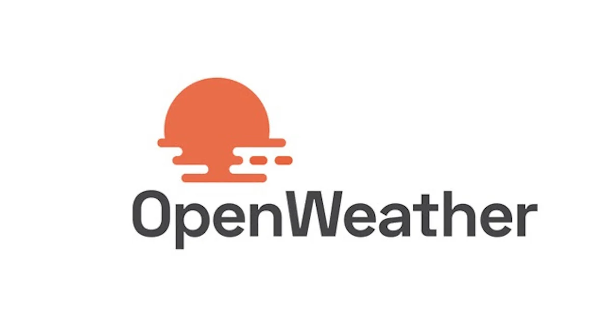

  
  
  
  
  
  
  
  

 

     
   

 

# Microservice OpenWeather Nodejs Jest AWS

  

Microservice for the integration of the Open Weather API with focus on unit and integration tests implementing Nodejs, Jest, Serverless-framework, aws-lambda, api gateway, git, others.  AWS services are tested locally. The project code and its documentation (less technical doc) have been developed in English.

*   [Weather-conditions](https://openweathermap.org/weather-conditions)
*   [Api keys](https://home.openweathermap.org/api_keys)
*   [Playlist functionality test](https://www.youtube.com/watch?v=oLSrmqMq0Zs\&list=PLCl11UFjHurB9JzGtm5e8-yp52IcZDs5y) 

 

## Index 📜

 
 See 

  

### Sección 1) Description, configuration and technologies.

*   [1.0) Project description.](#10-description-)
*   [1.1) Project execution.](#11-project-execution-)
*   [1.2) Project setup from scratch](#12-project-setup-from-scratch-)
*   [1.3) Technologies.](#13-technologies-)

### Sección 2) Endpoints and Examples

*   [2.0) Endpoints and resources.](#20-endpoints-and-resources-)
*   [2.1) Examples.](#21-examples-)

### Sección 3) Functionality test and references

*   [3.0) Functionality test.](#30-functionality-test-and-references-)
*   [3.1) References.](#31-references-)

 

 

## Sección 1) Description, configuration and technologies.

### 1.0) Description [🔝](#index-)

  
See

  

### 1.0.0) General description

### 1.0.1) Description Architecture and Operation

 

### 1.1) Project execution [🔝](#index-)

  
See

 

 

### 1.2) Project setup from scratch [🔝](#index-)

  
Ver

  

 

### 1.3) Technologies [🔝](#index-)

  
See

  

| **Technologies** | **Version** | **Purpose** |
| ------------- | ------------- | ------------- |
| [SDK](https://www.serverless.com/framework/docs/guides/sdk/) | 4.3.2  | Automatic Module Injection for Lambdas |
| [Serverless Framework Core v3](https://www.serverless.com//blog/serverless-framework-v3-is-live) | 3.23.0 | Core Services AWS |
| [Systems Manager Parameter Store (SSM)](https://docs.aws.amazon.com/systems-manager/latest/userguide/systems-manager-parameter-store.html) | 3.0 | Management of Environment Variables |
| [Jest](https://jestjs.io/) | 29.7 | Framework para pruebas unitarias, integración, etc. |
| [Amazon Api Gateway](https://docs.aws.amazon.com/apigateway/latest/developerguide/welcome.html) | 2.0 | API Manager, Authentication, Control and Processing |
| [NodeJS](https://nodejs.org/en/) | 14.18.1  | js library |
| [Sequelize](https://sequelize.org/) | ^6.11.0 | ORM |
| [Mysql](https://www.mysql.com/) | 10.1 | SGDB |
| [XAMPP](https://www.apachefriends.org/es/index.html) | 3.2.2 | Server package |
| [VSC](https://code.visualstudio.com/docs) | 1.72.2  | IDE |
| [Postman](https://www.postman.com/downloads/) | 10.11  | http client |
| [CMD](https://learn.microsoft.com/en-us/windows-server/administration/windows-commands/cmd) | 10 | Símbolo del Sistema para linea de comandos |
| [Git](https://git-scm.com/downloads) | 2.29.1  | Version control |
| Otros | Otros | Otros |

 

| **Plugin** |
| -------------  |
| [Serverless Plugin](https://www.serverless.com/plugins/) |
| [serverless-offline](https://www.npmjs.com/package/serverless-offline) |
| [serverless-offline-ssm](https://www.npmjs.com/package/serverless-offline-ssm) |

 

| **Extensión** |
| -------------  |
| Prettier - Code formatter |
| YAML - Autoformatter .yml |
| Error Lens - for errors and indent |
| Tabnine - IA Code |
| Otros - Otros |

 

 

## Sección 2) Endpoints and Examples.

### 2.0) Endpoints and resources [🔝](#index-)

  
See

 

### 2.1) Examples [🔝](#index-)

  
See

 

 

 

## Section 3) Functionality Testing and References.

### 3.0) Functionality test [🔝](#index-)

  
See

 

### 3.1) References [🔝](#índice-)

  
See

  

#### Configuration

*   [How to use Sequelize with Node.js and MySQL](https://jasonwatmore.com/post/2022/06/26/nodejs-mysql-connect-to-mysql-database-with-sequelize-mysql2)
*   [Recommended Video Tutorial](https://www.youtube.com/watch?v=im7THL67z0c)

#### Tools

*   [AWS Design Tool app.diagrams.net](https://app.diagrams.net/?splash=0\&libs=aws4)

#### Sequelize

*   [Models and Operators](https://sequelize.org/docs/v6/core-concepts/model-querying-basics/)

#### Free market

*   [Users and applications](https://developers.mercadolibre.com.ar/es_ar/usuarios-y-aplicaciones)
*   [Description of users](https://developers.mercadolibre.com.ar/es_ar/producto-consulta-usuarios)

#### Swagger with Serverless

*   [Autoswagger](https://www.npmjs.com/package/serverless-auto-swagger)
*   [Documentation serverless api](https://levelup.gitconnected.com/documenting-your-serverless-solutions-509f1928564b)

#### Open Apiv3 with Serverless

*   [serverless open api ](https://www.serverless.com/plugins/serverless-openapi-documentation)

#### API Gateway

*   [Best Api-Gateway Practices](https://docs.aws.amazon.com/whitepapers/latest/best-practices-api-gateway-private-apis-integration/rest-api.html)
*   [Creating Custom Api-keys](https://towardsaws.com/protect-your-apis-by-creating-api-keys-using-serverless-framework-fe662ad37447)
*   [Gateway Api properties configuration](https://www.serverless.com/framework/docs/providers/aws/guide/serverless.yml)

#### Serverless frameworks

*   [Plugins](https://www.serverless.com/plugins)

#### Libraries/Plugins

*   [Field validation](https://www.npmjs.com/package/node-input-validator)
*   [serverless-offline-ssm](https://www.serverless.com/plugins/serverless-offline-ssm)
*   [serverless open api ](https://www.serverless.com/plugins/serverless-openapi-documentation)

#### Jest

*   [Environment vars solution](https://stackoverflow.com/questions/48033841/test-process-env-with-jest)

 

